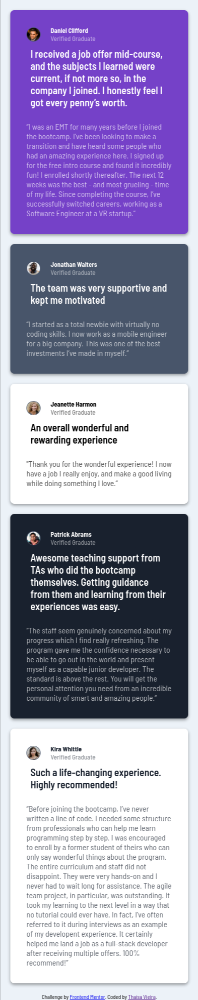
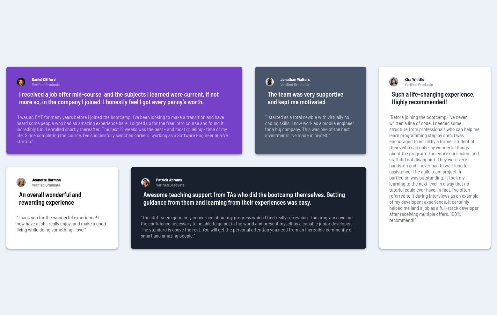

# Frontend Mentor - Testimonials grid section solution

This is a solution to the [Testimonials grid section challenge on Frontend Mentor](https://www.frontendmentor.io/challenges/testimonials-grid-section-Nnw6J7Un7), a junior level challenge from Frontend Mentor, where the goals is to build out and get it looking as close to the design as possible.

## Table of contents

- [Overview](#overview)
  - [The challenge](#the-challenge)
  - [Screenshot](#screenshot)
  - [Links](#links)
- [My process](#my-process)
  - [Built with](#built-with)
  - [What I learned](#what-i-learned)
  - [Useful resources](#useful-resources)
- [Author](#author)

## Overview
### The challenge

To do this challenge was recommend basic understanding of HTML and CSS, especially skills with grid and flexbox properties. It's important to highlight that the main requirement for this project is:

✅ Users should be able to view the optimal layout for the site depending on their device's screen size.

### Screenshot

Mobile version:

Desktop version:

### Links

- Solution URL: [GitHub repository](https://github.com/thaisavieira/testimonials-grid-section-main)
- Live Site URL: [GithHub Pages](https://thaisavieira.github.io/testimonials-grid-section-main/)

## My process

### Built with

- Semantic HTML5 markup
- CSS custom properties
- Flexbox
- CSS Grid
- Mobile-first workflow

### What I learned

This project was very important for fixing concepts and the use of properties, especially CSS Grid and was only possible starting with games like Grid Garden and mini fixing projects that I shared on my [CodePen's profile](https://codepen.io/thaisavieira).

### Useful resources

- [Kevin Powell's Youtube chanel](https://www.youtube.com/@KevinPowell/featured) - The content explained clearly and with examples helped me understand each property.
- [Grid Garden](https://cssgridgarden.com/) - This is an excellent simple grid visualization test for grid concepts.
- [CSS Tricks](https://css-tricks.com/) - Provides quick query on responsiveness, grid, flexbox and many other CSS topics.

## Author

- DEV.to - [/thaisavieira](https://dev.to/thaisavieira)
- Frontend Mentor - [@thaisavieira](https://www.frontendmentor.io/profile/thaisavieira)
- Mastodon - [@thaisa_vieira](https://techhub.social/@thaisa_vieira)

